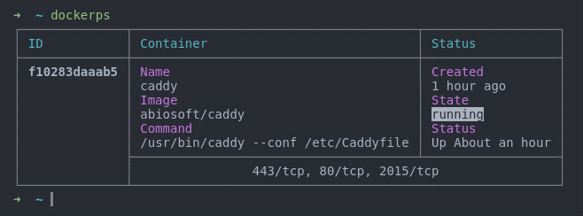

# dockerps

[](https://travis-ci.org/sadorlovsky/dockerps)
[](https://coveralls.io/github/sadorlovsky/dockerps?branch=master)

> A better `docker ps`



## Install
```
$ npm install -g dockerps
```

## Usage
```bash
# show running containers
$ dockerps

# show all containers
$ dockerps --all

# show the latest created container
$ dockerps --latest

# show 2 last created containers
$ dockerps --last 2
```

## License

MIT © [Zach Orlovsky](https://orlovsky.rocks)
